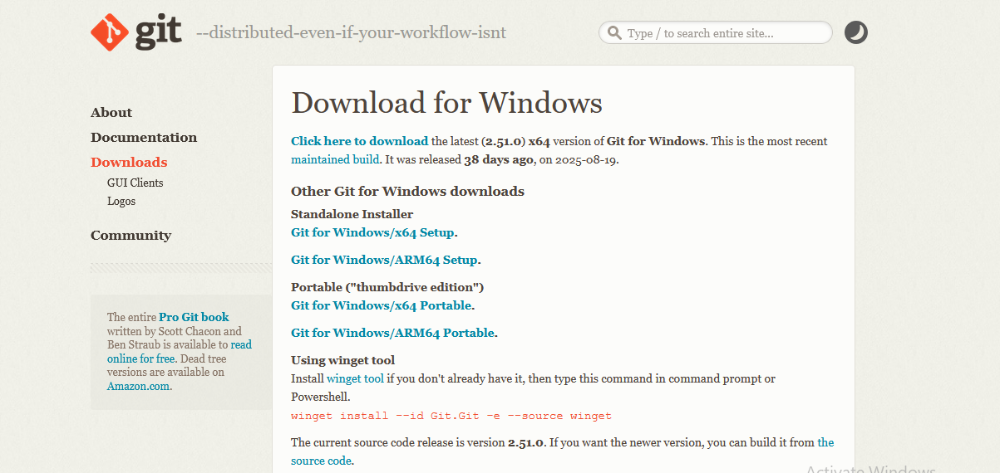

# Praktikum Tugas 1
## Informasi Dosen
- Nama Dosen : Adi Wahyu Pribadi, S.Si., M.Kom
## Mahasiswa
- Nama : Waode Fairuzh Ramadhani Somandeno
- NPM : 4523210111
##  Praktikum Tugas 1
- Langkah-Langkah:

- Download GIT

- Setelah Github didownload, cek Version GIT

- Setelah Cek Version, lakukan perintah pada gambar, dibawah. Yang akan berfungsi untuk membuat repository

- Buat Folder PRAK PBW-A di VScode. Setelah itu folder di dalam PRAK PBW-A dibuat folder lagi yaitu, praktikum 1.git

- Kemudian, hubungkan link folder yang telah dibuat di github ke VScode

- Lalu, jika kita ingin menggabungkan semua file didalam folder kita bisa memberikan perintah

- Kemudian jika ingin menyimpan data pada repository jika terjadi kesalahan pada folder kita bisa melakukan

- Setelah itu jika ingin melakukan brach, kita terlebih dahulu melakukan perintah berikut agar tidak terjadi error

- Lalu, kita melakukan perintah dibawah,setelah melakukan perintah dibawah folder yang berada di VScode dapat terhubung di folder github dilink awal